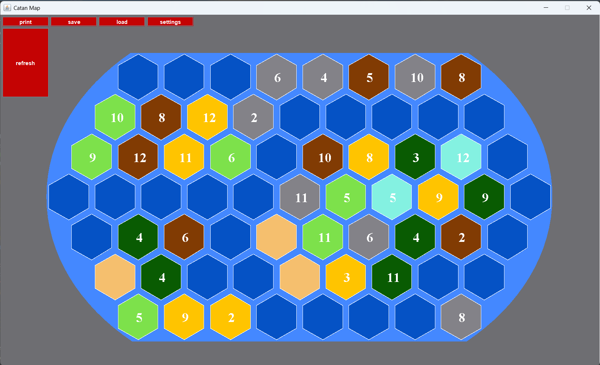
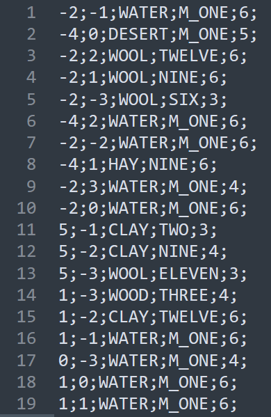

# Catan Random Map Generator

A procedural map generator for a Catan-inspired hexagonal board game, developed in Java.

---

## 🧭 Overview

This project generates playable, rule-compliant maps inspired by **Catan + Seafarers**. It allows the random generation with custom parameters, including number of island, number of player, if one wants secondary and primary islands and how big they must be relative to the others.

Map generation adheres to key gameplay constraints like token adjacency and resource balance.

---

## 🖼️ Screenshots

### GUI


### Settings


### Sample Config File


### Sample `.map` File


### Exported Printed Map


---

## ⚙️ Features

- ✅ Interactive GUI to configure and preview maps
- 💾 Save/load `.map` files (plain text format)
- 🖨️ Export board as PNG
- 🧠 Persistent user settings via config file
- 📜 Verbose logging for generation steps

---

## 🧪 Procedural Generation Logic

Generation is rule-aware, with randomized placement constrained by:
- Valid number token rules (no adjacent 6/8)
- Balanced terrain/resource distribution
- Dynamic island creation based on user input
- Player starting zones based on island count

---

## 🕹️ Usage

### 1. Run the Application

- Requires **Java 14+**
- Download the latest **Release** from the GitHub Releases page (JAR + launcher scripts).
- After downloading, edit `launcher.vbs` to point to the correct `launcher.bat` path on your machine:

```vbscript
batPath = "C:\Path\To\launcher.bat"
